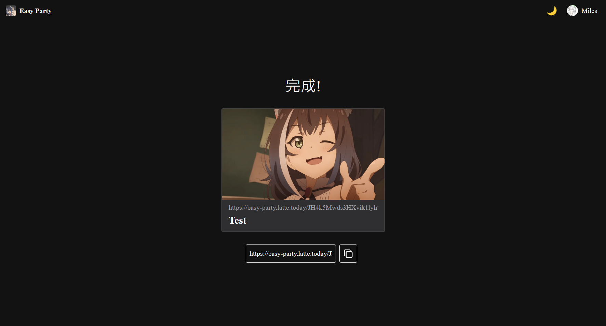
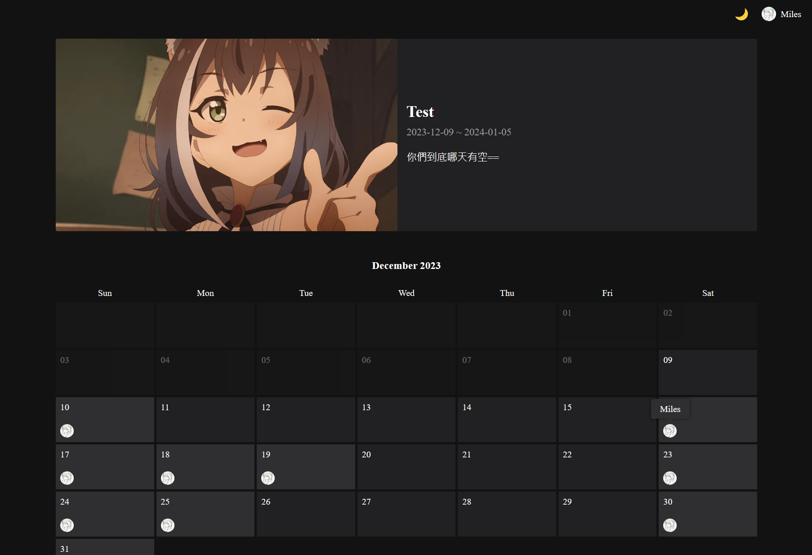
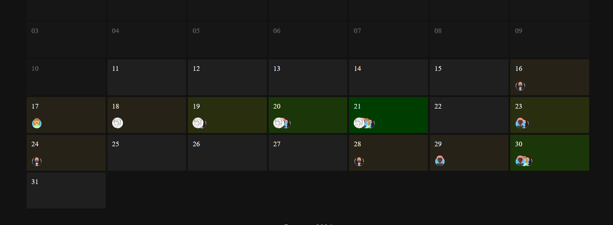
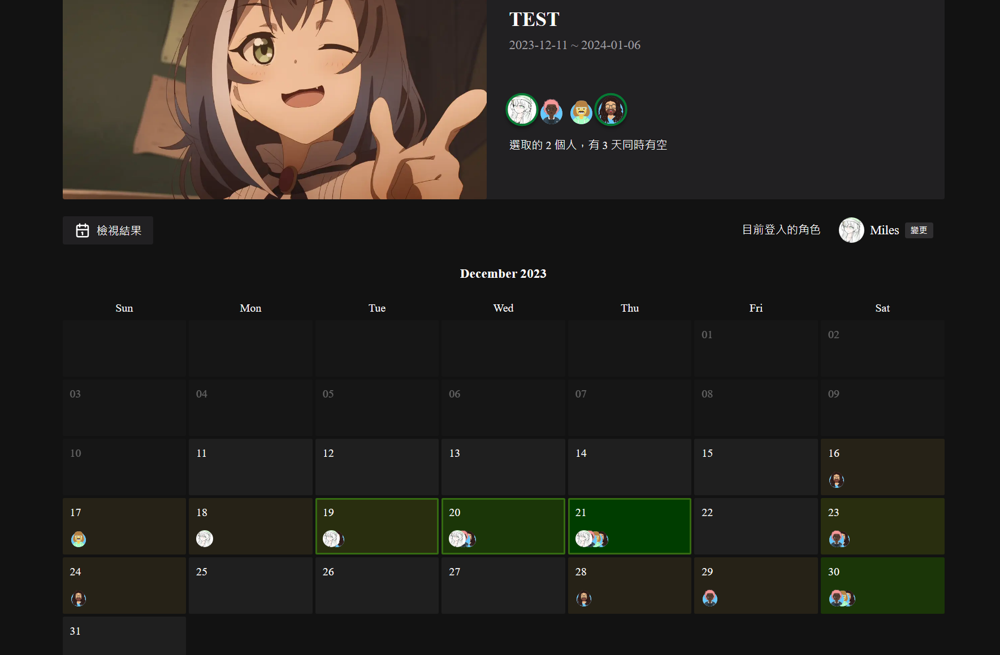
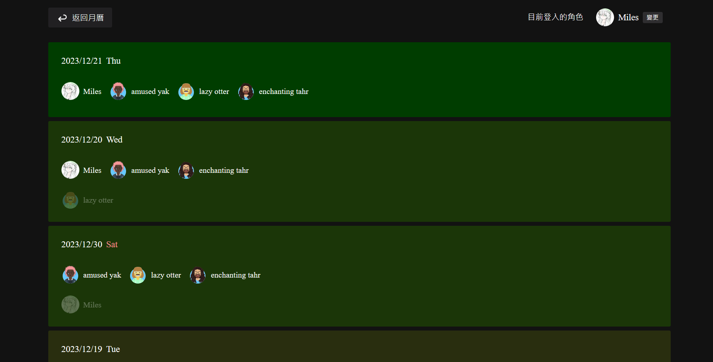
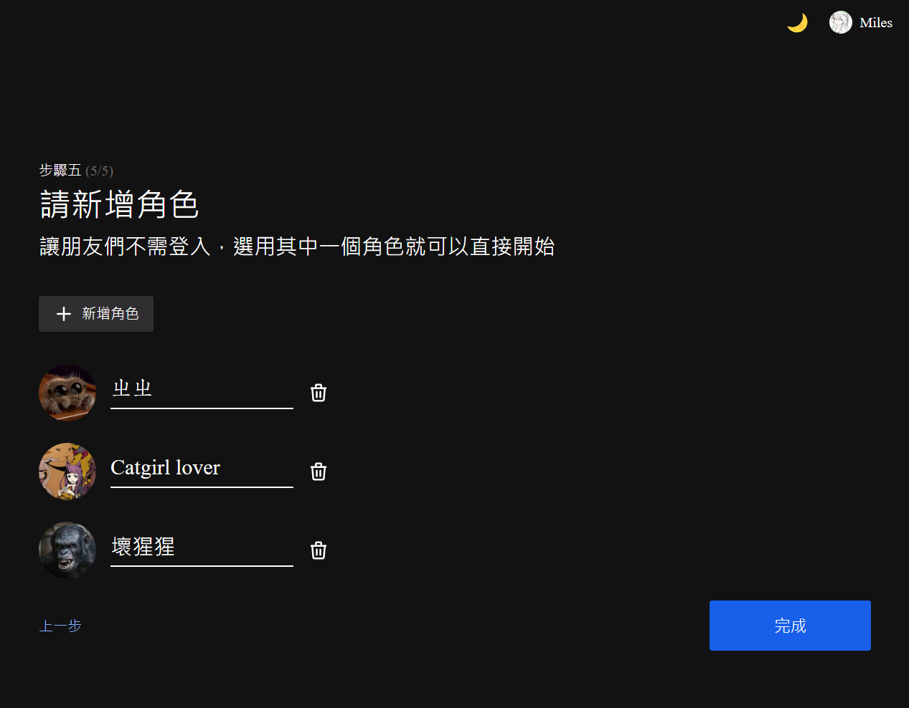

# Easy Party

約朋友出來聚餐用的
  
## 使用方法
按下立刻建立聚會按鈕，逐步設定完後會拿到一個月曆頁面的連結

### 基本操作
點擊月曆上的日期標記自己有空的日期  

比較多人有空的日期，背景顏色會比較綠

  
### 篩選日期
點選資訊卡上的頭像，可以Highlight選中的使用者們都有空的日期

### 檢視結果
依照同時有空的人數由上到下排列日期

### 免登入角色
建立月曆時，可以為不方便登入或是沒有google帳號的朋友建立匿名角色

在進入有設置匿名角色的月曆時，會出現角色選擇頁面  

選擇匿名角色便可直接以匿名角色的身份編輯月曆